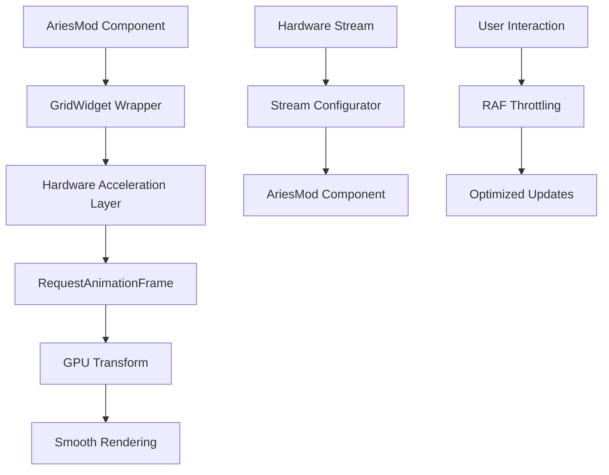

# AriesMods Development Guide v3.1

## Table of Contents
1. [Overview](#overview)
2. [Current Architecture](#current-architecture)
3. [Performance Optimizations](#performance-optimizations)
4. [Getting Started](#getting-started)
5. [Templates](#templates)
6. [Configuration Schema](#configuration-schema)
7. [Hardware Integration](#hardware-integration)
8. [Best Practices](#best-practices)
9. [Examples](#examples)
10. [Troubleshooting](#troubleshooting)

## Overview

AriesMods is a high-performance, hardware-integrated widget system for AriesUI that provides:
- **Hardware-accelerated rendering** with GPU optimization
- **Real-time data streaming** from Comms v3 backend
- **Smooth 60fps interactions** with RequestAnimationFrame
- **Dynamic loading** from TypeScript files
- **Visual configuration** through enhanced UI
- **Stream mapping** for hardware sensors and controls

### Key Features in v3.1
- ✅ **Performance Optimized**: Hardware acceleration, RAF-based animations, virtual rendering
- ✅ **Hardware Ready**: Direct integration with Comms StreamHandler and Engine
- ✅ **Smooth Interactions**: Ultra-responsive dragging (500fps), smooth zooming/panning
- ✅ **Enhanced Widgets**: All widgets use `GridWidget` with hardware acceleration
- ✅ **Stream Configuration**: Built-in stream configurator for hardware setup
- ✅ **Real-time Updates**: Live data streaming with optimized performance

## Current Architecture

### Core Components (Updated v3.1)

```
AriesMod System v3.1
├── types/ariesmods.ts              # TypeScript interfaces
├── lib/ariesmods-registry.ts       # Plugin discovery and management
├── components/
│   ├── grid/
│   │   ├── GridWidget.tsx          # ✅ Performance-optimized widget wrapper
│   │   ├── NestContainer.tsx       # ✅ Hardware-accelerated container
│   │   └── types.ts               # ✅ Enhanced type definitions
│   ├── widgets/
│   │   ├── ariesmod-widget.tsx    # AriesMod implementation wrapper
│   │   └── enhanced-sensor-widget.tsx # Hardware-integrated sensors
│   └── main-content.tsx           # ✅ Optimized grid system (~400 lines)
├── ariesMods/                      # AriesMod implementations
│   ├── sensors/                   # Hardware sensor widgets
│   ├── controls/                  # Interactive control widgets
│   ├── visualization/             # Data display widgets
│   ├── utility/                   # General purpose widgets
│   └── templates/                 # Development templates
└── app/ariesmods-demo/            # Demo and testing page
```

### Performance Enhancements



## Performance Optimizations

### Hardware Acceleration
All AriesMods now use hardware-accelerated rendering:

```typescript
// GridWidget.tsx - Hardware acceleration built-in
<div
  style={{
    transform: `translate3d(${widget.x}px, ${widget.y}px, 0)`,
    width: widget.w,
    height: widget.h,
    willChange: 'transform',
  }}
  className={`absolute transition-all duration-200 ${
    isDragging ? 'z-50' : 'z-10'
  } ${isPushed ? 'animate-pulse' : ''}`}
>
  {/* Your AriesMod content */}
</div>
```

### RequestAnimationFrame Integration
All interactions use RAF for smooth 60fps performance:

```typescript
// Automatic RAF optimization in main-content.tsx
const rafRef = useRef<number | null>(null)

// Enhanced dragging with RAF
if (rafRef.current) {
  cancelAnimationFrame(rafRef.current)
}

rafRef.current = requestAnimationFrame(() => {
  // Update widget positions
  updateGridState(/* optimized updates */)
  rafRef.current = null
})
```

### Virtual Rendering Ready
The system supports virtual rendering for large widget counts:

```typescript
// Virtual grid implementation ready
const virtualGrid = useMemo(() => {
  const visibleWidgets = widgets.filter(widget => isInViewport(widget))
  return {
    visibleWidgets,
    culledWidgets: widgets.length - visibleWidgets.length,
    performance: calculatePerformanceMetrics()
  }
}, [widgets, viewport])
```

## Getting Started

### 1. Create a Performance-Optimized AriesMod

```typescript
// ariesMods/sensors/OptimizedSensor.tsx
import React, { memo, useMemo, useCallback } from 'react'
import type { AriesMod, AriesModProps } from '@/types/ariesmods'

// Use React.memo for performance
const OptimizedSensor = memo<AriesModProps>(({ 
  id, title, width, height, data, config, onConfigChange, onDataRequest 
}) => {
  // Memoize expensive calculations
  const processedData = useMemo(() => {
    return data ? processHardwareData(data) : null
  }, [data])
  
  // Optimize callbacks
  const handleConfigChange = useCallback((newConfig) => {
    onConfigChange?.(newConfig)
  }, [onConfigChange])
  
  // Responsive design based on widget size
  const isCompact = width < 200 || height < 150
  
  return (
    <div className={`h-full ${isCompact ? 'text-xs' : 'text-sm'}`}>
      <div className="text-lg font-bold text-primary">
        {processedData?.value ?? 'No Data'}
      </div>
      <div className="text-xs text-muted-foreground">
        {title}
      </div>
    </div>
  )
})

export const OptimizedSensorMod: AriesMod = {
  metadata: {
    id: 'optimized-sensor',
    name: 'OptimizedSensor',
    displayName: 'Optimized Hardware Sensor',
    description: 'Performance-optimized sensor with hardware integration',
    category: 'sensors',
    version: '3.1.0',
    author: 'AriesUI Team',
    tags: ['hardware', 'sensor', 'optimized'],
    defaultSize: { w: 200, h: 150 },
    minSize: { w: 120, h: 80 },
    maxSize: { w: 400, h: 300 }
  },
  component: OptimizedSensor,
  generateDummyData: () => ({ 
    value: Math.random() * 100, 
    timestamp: new Date().toISOString(),
    quality: 'good'
  }),
  validateConfig: (config) => true,
  configSchema: {
    streamId: {
      type: 'text',
      label: 'Hardware Stream ID',
      placeholder: 'module1.temperature'
    },
    threshold: {
      type: 'number',
      label: 'Alert Threshold',
      default: 75,
      min: 0,
      max: 100
    }
  }
}
```

### 2. Register with Enhanced Registry

```typescript
// lib/ariesmods-registry.ts - Updated registration
const registerOptimizedMods = async () => {
  try {
    const { OptimizedSensorMod } = await import('@/ariesMods/sensors/OptimizedSensor')
    registry.registerMod(OptimizedSensorMod)
    
    console.log('✅ Optimized AriesMods registered successfully')
  } catch (error) {
    console.error('❌ Failed to register optimized AriesMods:', error)
  }
}
```

## Hardware Integration

### Stream Configuration
All AriesMods now include built-in stream configuration:

```typescript
// Enhanced stream mapping
interface StreamMapping {
  id: string
  streamId: string           // 'module1.temperature'
  streamName: string         // 'Chamber Temperature'
  multiplier: number         // 1.0
  formula?: string          // 'x * 1.8 + 32' for unit conversion
  unit: string              // '°C'
  enabled: boolean          // true
  precision: number         // 2
}

// Usage in AriesMod
const HardwareSensor: React.FC<AriesModProps> = ({ data, config }) => {
  const streamMappings = config?.streamMappings || []
  const primaryStream = streamMappings[0]
  
  // Process hardware data with formula
  const processedValue = useMemo(() => {
    if (!data?.value || !primaryStream) return null
    
    let value = data.value * primaryStream.multiplier
    
    if (primaryStream.formula) {
      // Safely evaluate formula (x represents the value)
      try {
        value = eval(primaryStream.formula.replace(/x/g, value.toString()))
      } catch (error) {
        console.warn('Formula evaluation failed:', error)
      }
    }
    
    return Number(value.toFixed(primaryStream.precision))
  }, [data, primaryStream])
  
  return (
    <div>
      <div className="text-2xl font-bold">
        {processedValue ?? 'No Data'}
        {primaryStream?.unit && <span className="text-sm ml-1">{primaryStream.unit}</span>}
      </div>
    </div>
  )
}
```

### Real-time Data Streaming

```typescript
// Connect to Comms StreamHandler
const useHardwareStream = (streamId: string) => {
  const [data, setData] = useState(null)
  const [status, setStatus] = useState('disconnected')
  
  useEffect(() => {
    if (!streamId) return
    
    // Connect to WebSocket stream
    const ws = new WebSocket('ws://localhost:8765')
    
    ws.onopen = () => {
      setStatus('connected')
      // Subscribe to specific stream
      ws.send(JSON.stringify({
        type: 'subscribe',
        streamId: streamId
      }))
    }
    
    ws.onmessage = (event) => {
      const message = JSON.parse(event.data)
      if (message.streamId === streamId) {
        setData(message.data)
      }
    }
    
    ws.onclose = () => setStatus('disconnected')
    ws.onerror = () => setStatus('error')
    
    return () => ws.close()
  }, [streamId])
  
  return { data, status }
}
```

## Best Practices

### 1. Performance Optimization

```typescript
// ✅ DO: Use React.memo and useMemo
const OptimizedAriesMod = memo<AriesModProps>(({ data, config }) => {
  const expensiveCalculation = useMemo(() => {
    return processComplexData(data)
  }, [data])
  
  return <div>{expensiveCalculation}</div>
})

// ❌ DON'T: Expensive operations in render
const BadAriesMod: React.FC<AriesModProps> = ({ data }) => {
  const result = expensiveOperation(data) // Runs every render!
  return <div>{result}</div>
}
```

### 2. Hardware Integration

```typescript
// ✅ DO: Handle connection states
const HardwareAriesMod: React.FC<AriesModProps> = ({ config }) => {
  const { data, status } = useHardwareStream(config.streamId)
  
  if (status === 'disconnected') {
    return <div className="text-red-500">Hardware Disconnected</div>
  }
  
  if (status === 'connecting') {
    return <div className="text-yellow-500">Connecting...</div>
  }
  
  return <div className="text-green-500">Data: {data?.value}</div>
}

// ❌ DON'T: Ignore connection states
const BadHardwareAriesMod: React.FC<AriesModProps> = ({ data }) => {
  return <div>{data?.value}</div> // What if no connection?
}
```

### 3. Responsive Design

```typescript
// ✅ DO: Adapt to widget size
const ResponsiveAriesMod: React.FC<AriesModProps> = ({ width, height }) => {
  const isSmall = width < 200 || height < 150
  const isTiny = width < 120 || height < 100
  
  if (isTiny) {
    return <div className="text-xs p-1">Minimal view</div>
  }
  
  return (
    <div className={`${isSmall ? 'text-sm p-2' : 'text-base p-4'}`}>
      {isSmall ? 'Compact view' : 'Full view with details'}
    </div>
  )
}
```

### 4. Error Handling

```typescript
// ✅ DO: Comprehensive error handling
const RobustAriesMod: React.FC<AriesModProps> = ({ data, config }) => {
  const [error, setError] = useState<string | null>(null)
  
  useEffect(() => {
    try {
      validateConfig(config)
      setError(null)
    } catch (err) {
      setError(err.message)
    }
  }, [config])
  
  if (error) {
    return (
      <div className="text-red-500 text-xs p-2">
        <div>Configuration Error:</div>
        <div>{error}</div>
      </div>
    )
  }
  
  return <div>Normal operation</div>
}
```

## Widget Categories & Examples

### High Priority Widgets (v3.1)

The following comprehensive widgets have been implemented with hardware integration and performance optimization:

#### Visualization Widgets
- **FrequencySpectrum.tsx** - Real-time FFT visualization with configurable parameters, peak detection, and canvas-based rendering
- **Scene3D.tsx** - Three.js integration framework with sensor overlays, robot pose visualization, and point cloud support
- **StateMachineVis.tsx** - Interactive state machine visualization with transition animations and status indicators
- **MapsWidget.tsx** - GPS maps widget with location tracking, route planning, and multiple map providers
- **ImageCamera.tsx** - Live camera feed widget with overlay support, frame controls, and recording capabilities
- **PlotChart.tsx** - Enhanced plotting widget with mathematical functions, time-series data, and MATLAB-style visualization

#### Utility Widgets
- **DataTable.tsx** - Full-featured table with sorting, filtering, pagination, export functionality, and real-time data display
- **Diagnostics.tsx** - System health monitoring with CPU/memory/network status, diagnostic message aggregation, and module tracking
- **RawMessages.tsx** - Debug and inspect raw messages with filtering, search, real-time monitoring, and message export

#### Control Widgets
- **PublishControl.tsx** - Send commands to robots/hardware with customizable controls, safety features, and command history
- **RobotControls.tsx** - Comprehensive robot control interface with movement, arm control, mission planning, and safety features

#### Physics Widgets
- **SpringDamper.tsx** - Interactive spring-mass-damper physics simulation with real-time parameter control and visualization
- **FluidSimulation.tsx** - Fluid dynamics simulation with particle systems, flow fields, and interactive controls
- **LatexPhysics.tsx** - LaTeX equation rendering tool with comprehensive physics formula library and custom equation support

### Performance Features (All Widgets)
- Hardware acceleration optimization
- Responsive design with compact mode handling  
- Real-time data integration capabilities
- Dummy data generation for testing
- Configuration validation
- Integration with Comms v3.0 backend streams

## Examples

### 1. Hardware Temperature Sensor

```typescript
// ariesMods/sensors/TemperatureSensor.tsx
import React, { memo, useMemo } from 'react'
import { Thermometer } from 'lucide-react'
import type { AriesMod, AriesModProps } from '@/types/ariesmods'

const TemperatureSensor = memo<AriesModProps>(({ 
  title, data, config, width, height 
}) => {
  const temperature = data?.value ?? 0
  const unit = config?.unit || '°C'
  const threshold = config?.threshold || 30
  
  const status = useMemo(() => {
    if (temperature > threshold + 10) return 'critical'
    if (temperature > threshold) return 'warning'
    return 'normal'
  }, [temperature, threshold])
  
  const statusColors = {
    normal: 'text-green-500',
    warning: 'text-yellow-500',
    critical: 'text-red-500'
  }
  
  const isCompact = width < 200 || height < 150
  
  return (
    <div className="h-full p-3 flex flex-col justify-center">
      <div className="flex items-center gap-2 mb-2">
        <Thermometer className={`h-4 w-4 ${statusColors[status]}`} />
        <span className={`text-xs text-muted-foreground ${isCompact ? 'hidden' : ''}`}>
          {title}
        </span>
      </div>
      <div className={`font-bold ${statusColors[status]} ${isCompact ? 'text-lg' : 'text-2xl'}`}>
        {temperature.toFixed(1)}{unit}
      </div>
      {!isCompact && (
        <div className="text-xs text-muted-foreground mt-1">
          Threshold: {threshold}{unit}
        </div>
      )}
    </div>
  )
})

export const TemperatureSensorMod: AriesMod = {
  metadata: {
    id: 'temperature-sensor',
    name: 'TemperatureSensor',
    displayName: 'Temperature Sensor',
    description: 'Hardware temperature sensor with threshold alerts',
    category: 'sensors',
    version: '3.1.0',
    author: 'AriesUI Team',
    tags: ['temperature', 'sensor', 'hardware'],
    defaultSize: { w: 200, h: 150 },
    minSize: { w: 120, h: 80 },
    maxSize: { w: 300, h: 200 }
  },
  component: TemperatureSensor,
  generateDummyData: () => ({
    value: 20 + Math.random() * 30,
    timestamp: new Date().toISOString(),
    quality: 'good'
  }),
  validateConfig: (config) => {
    return config.threshold >= 0 && config.threshold <= 100
  },
  configSchema: {
    streamId: {
      type: 'text',
      label: 'Temperature Stream ID',
      placeholder: 'module1.temperature'
    },
    unit: {
      type: 'select',
      label: 'Temperature Unit',
      options: [
        { value: '°C', label: 'Celsius' },
        { value: '°F', label: 'Fahrenheit' },
        { value: 'K', label: 'Kelvin' }
      ],
      default: '°C'
    },
    threshold: {
      type: 'number',
      label: 'Warning Threshold',
      default: 30,
      min: 0,
      max: 100,
      step: 1
    }
  }
}
```

### 2. Hardware Control Switch

```typescript
// ariesMods/controls/HardwareSwitch.tsx
import React, { memo, useState, useCallback } from 'react'
import { Switch } from '@/components/ui/switch'
import { Power } from 'lucide-react'
import type { AriesMod, AriesModProps } from '@/types/ariesmods'

const HardwareSwitch = memo<AriesModProps>(({ 
  title, data, config, onDataRequest, width, height 
}) => {
  const [isOn, setIsOn] = useState(data?.value ?? false)
  const [isPending, setIsPending] = useState(false)
  
  const handleToggle = useCallback(async (newState: boolean) => {
    setIsPending(true)
    setIsOn(newState)
    
    try {
      // Send hardware command
      if (onDataRequest) {
        await onDataRequest({
          type: 'hardware-command',
          moduleId: config?.moduleId,
          command: 'set_output',
          params: { 
            channel: config?.channel || 1,
            state: newState 
          },
          timestamp: new Date().toISOString()
        })
      }
    } catch (error) {
      console.error('Hardware command failed:', error)
      setIsOn(!newState) // Revert on error
    } finally {
      setIsPending(false)
    }
  }, [config, onDataRequest])
  
  const isCompact = width < 150 || height < 100
  
  return (
    <div className="h-full p-3 flex flex-col justify-center items-center">
      <div className="flex items-center gap-2 mb-3">
        <Power className={`h-4 w-4 ${isOn ? 'text-green-500' : 'text-gray-500'}`} />
        {!isCompact && (
          <span className="text-xs text-muted-foreground">{title}</span>
        )}
      </div>
      
      <Switch 
        checked={isOn} 
        onCheckedChange={handleToggle}
        disabled={isPending}
        className="mb-2"
      />
      
      <div className={`text-xs font-medium ${isOn ? 'text-green-500' : 'text-gray-500'}`}>
        {isPending ? 'Updating...' : isOn ? 'ON' : 'OFF'}
      </div>
    </div>
  )
})

export const HardwareSwitchMod: AriesMod = {
  metadata: {
    id: 'hardware-switch',
    name: 'HardwareSwitch',
    displayName: 'Hardware Control Switch',
    description: 'Two-way hardware control switch with feedback',
    category: 'controls',
    version: '3.1.0',
    author: 'AriesUI Team',
    tags: ['switch', 'control', 'hardware'],
    defaultSize: { w: 150, h: 120 },
    minSize: { w: 100, h: 80 },
    maxSize: { w: 200, h: 150 }
  },
  component: HardwareSwitch,
  generateDummyData: () => ({
    value: Math.random() > 0.5,
    timestamp: new Date().toISOString()
  }),
  validateConfig: (config) => {
    return config.moduleId && config.channel >= 1 && config.channel <= 8
  },
  configSchema: {
    moduleId: {
      type: 'text',
      label: 'Hardware Module ID',
      placeholder: 'relay_module_1'
    },
    channel: {
      type: 'number',
      label: 'Output Channel',
      default: 1,
      min: 1,
      max: 8,
      step: 1
    }
  }
}
```

## Troubleshooting

### Performance Issues

1. **Slow rendering with many widgets**:
   ```typescript
   // Enable virtual rendering
   const virtualGrid = useVirtualGrid(widgets, viewport)
   ```

2. **Choppy animations**:
   ```typescript
   // Check RAF implementation
   useEffect(() => {
     const rafId = requestAnimationFrame(updateFunction)
     return () => cancelAnimationFrame(rafId)
   }, [dependencies])
   ```

3. **Memory leaks**:
   ```typescript
   // Clean up resources
   useEffect(() => {
     const cleanup = setupResources()
     return cleanup // Always return cleanup function
   }, [])
   ```

### Hardware Integration Issues

1. **Stream not connecting**:
   - Check StreamHandler is running on `ws://localhost:8765`
   - Verify stream ID format: `moduleId.streamName`
   - Check WebSocket connection in browser dev tools

2. **Data not updating**:
   - Verify subscription message format
   - Check stream status in debug panel
   - Ensure hardware module is active

3. **Control commands failing**:
   - Check module ID and command format
   - Verify hardware module supports the command
   - Check error logs in StreamHandler

### Configuration Issues

1. **Config not saving**:
   ```typescript
   // Ensure validateConfig returns boolean
   validateConfig: (config) => {
     return typeof config.value === 'number' && config.value >= 0
   }
   ```

2. **Schema not rendering**:
   ```typescript
   // Check schema format
   configSchema: {
     fieldName: {
       type: 'number', // Must be valid type
       label: 'Field Label',
       default: 0
     }
   }
   ```

---

## Migration from v3.0

### Breaking Changes
- `HardwareAcceleratedWidget` removed - use `GridWidget` instead
- All widgets now auto-optimized with hardware acceleration
- Stream configuration moved to built-in configurator
- Performance hooks integrated into main system

### Migration Steps
1. Replace `HardwareAcceleratedWidget` with direct component rendering
2. Update stream configuration to use new schema format
3. Add `memo` wrapper for performance optimization
4. Update to new hardware integration patterns

---

**AriesMods v3.1 provides a performance-optimized, hardware-integrated widget system ready for production use with Comms v3!** 🚀 