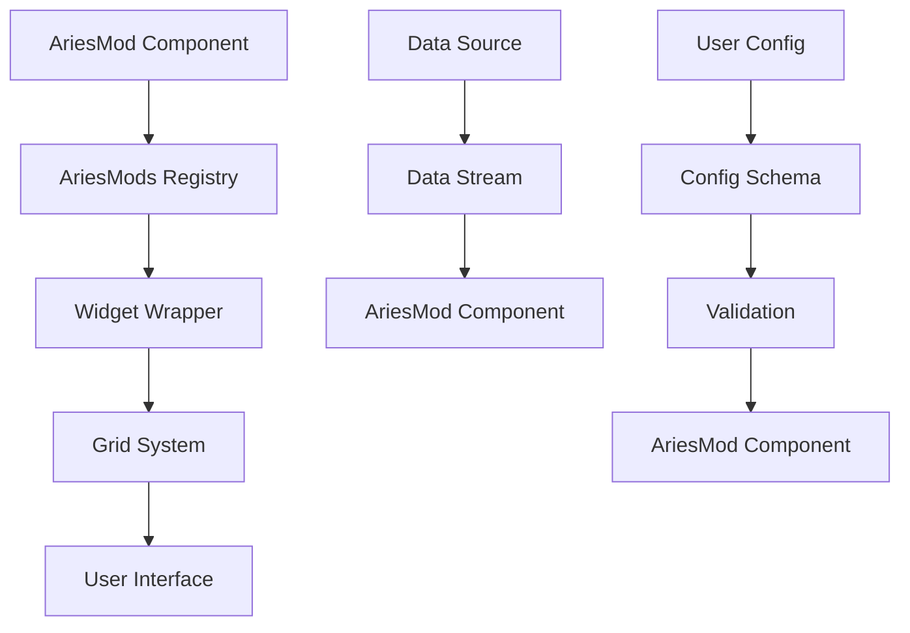

# AriesMods Development Guide

## Table of Contents
1. [Overview](#overview)
2. [Architecture](#architecture)
3. [Getting Started](#getting-started)
4. [Templates](#templates)
5. [Configuration Schema](#configuration-schema)
6. [Data Handling](#data-handling)
7. [Best Practices](#best-practices)
8. [Examples](#examples)
9. [Integration with Comms v3](#integration-with-comms-v3)
10. [Troubleshooting](#troubleshooting)

## Overview

AriesMods is a plugin-based widget system for AriesUI that allows developers to create custom, reusable components that can be:
- Dynamically loaded from TypeScript files
- Configured through a visual interface
- Dragged and dropped into the grid system
- Integrated with real-time data streams
- Resized and repositioned on the fly

### Key Features
- **Hot-swappable**: Add new AriesMods without restarting the application
- **Configurable**: Rich configuration schema with validation
- **Reactive**: Real-time data updates and user interactions
- **Themed**: Consistent styling with AriesUI design system
- **Categorized**: Organized by functionality (Sensors, Controls, Visualization, Utility, Custom)

## Architecture

### Core Components

```
AriesMod System
├── types/ariesmods.ts          # TypeScript interfaces
├── lib/ariesmods-registry.ts   # Plugin discovery and management
├── components/widgets/         # Widget wrapper components
├── ariesMods/                  # AriesMod implementations
│   ├── sensors/               # Data collection widgets
│   ├── controls/              # Interactive control widgets
│   ├── visualization/         # Data display widgets
│   ├── utility/               # General purpose widgets
│   └── templates/             # Development templates
└── app/ariesmods-demo/        # Demo and testing page
```

### Data Flow



## Getting Started

### 1. Create a New AriesMod

Choose a category for your AriesMod:
- `sensors/` - Data collection (temperature, pressure, etc.)
- `controls/` - Interactive elements (switches, sliders, etc.)
- `visualization/` - Data display (charts, graphs, etc.)
- `utility/` - General purpose (clocks, calculators, etc.)
- `custom/` - Custom functionality

### 2. Use the Template

Start with the basic template:

```bash
cp ariesMods/templates/BasicAriesMod.tsx ariesMods/[category]/YourAriesMod.tsx
```

### 3. Implement Your Component

Edit the template to implement your functionality:

```typescript
// ariesMods/sensors/YourSensor.tsx
import React from 'react'
import type { AriesMod, AriesModProps, AriesModData } from '@/types/ariesmods'

const YourSensor: React.FC<AriesModProps> = ({ 
  id, title, width, height, data, config, onConfigChange, onDataRequest 
}) => {
  // Your implementation here
  return <div>Your sensor component</div>
}

export const YourSensorMod: AriesMod = {
  metadata: {
    id: 'your-sensor',
    name: 'YourSensor',
    displayName: 'Your Sensor Name',
    description: 'What your sensor does',
    category: 'sensors',
    // ... other metadata
  },
  component: YourSensor,
  generateDummyData: () => ({ value: 42, timestamp: new Date().toISOString() }),
  validateConfig: (config) => true
}
```

### 4. Register Your AriesMod

Add your AriesMod to the registry:

```typescript
// lib/ariesmods-registry.ts
const { YourSensorMod } = await import('@/ariesMods/sensors/YourSensor')
this.registerMod(YourSensorMod)
```

## Templates

### Basic Template Structure

```typescript
import React from 'react'
import type { AriesMod, AriesModProps, AriesModData } from '@/types/ariesmods'

// 1. Define your configuration interface
export interface YourAriesModConfig {
  setting1: string
  setting2: number
  setting3: boolean
}

// 2. Set default configuration
const defaultConfig: YourAriesModConfig = {
  setting1: 'default value',
  setting2: 100,
  setting3: true
}

// 3. Create your component
const YourAriesMod: React.FC<AriesModProps> = (props) => {
  const config = { ...defaultConfig, ...props.config } as YourAriesModConfig
  
  // Your component logic
  return <div>Your component JSX</div>
}

// 4. Export your AriesMod
export const YourAriesModDefinition: AriesMod = {
  metadata: { /* ... */ },
  component: YourAriesMod,
  generateDummyData: () => ({ /* ... */ }),
  validateConfig: (config) => true
}
```

### Available Templates

| Template | Description | Use Case |
|----------|-------------|----------|
| `BasicAriesMod.tsx` | Simple display widget | Basic information display |
| `SensorTemplate.tsx` | Sensor data display | Hardware sensors, API data |
| `ControlTemplate.tsx` | Interactive controls | Buttons, sliders, toggles |
| `ChartTemplate.tsx` | Data visualization | Charts, graphs, meters |

## Configuration Schema

### Schema Types

```typescript
interface ConfigField {
  type: 'text' | 'number' | 'boolean' | 'select' | 'color' | 'range'
  label: string
  default?: any
  placeholder?: string
  min?: number
  max?: number
  step?: number
  options?: Array<{ value: any; label: string }>
}
```

### Example Configuration

```typescript
configSchema: {
  title: {
    type: 'text',
    label: 'Widget Title',
    default: 'My Widget',
    placeholder: 'Enter title'
  },
  threshold: {
    type: 'number',
    label: 'Alert Threshold',
    default: 100,
    min: 0,
    max: 1000,
    step: 10
  },
  enabled: {
    type: 'boolean',
    label: 'Enable Alerts',
    default: true
  },
  mode: {
    type: 'select',
    label: 'Display Mode',
    options: [
      { value: 'simple', label: 'Simple View' },
      { value: 'detailed', label: 'Detailed View' }
    ],
    default: 'simple'
  },
  color: {
    type: 'color',
    label: 'Primary Color',
    default: '#3b82f6'
  },
  sensitivity: {
    type: 'range',
    label: 'Sensitivity',
    default: 50,
    min: 0,
    max: 100,
    step: 5
  }
}
```

## Data Handling

### Data Types

```typescript
interface AriesModData {
  value: any
  timestamp: string
  metadata?: Record<string, any>
}
```

### Real-time Data

```typescript
// Request data updates
React.useEffect(() => {
  if (onDataRequest) {
    const interval = setInterval(() => {
      onDataRequest({ 
        type: 'sensor-reading',
        id: 'temperature-01',
        timestamp: new Date().toISOString() 
      })
    }, 1000)
    
    return () => clearInterval(interval)
  }
}, [onDataRequest])

// Handle incoming data
React.useEffect(() => {
  if (data) {
    // Process your data
    console.log('Received data:', data)
  }
}, [data])
```

### Dummy Data Generation

```typescript
const generateDummyData = (): AriesModData => {
  return {
    value: Math.random() * 100,
    timestamp: new Date().toISOString(),
    metadata: {
      sensor: 'temperature-01',
      unit: '°C',
      quality: 'good'
    }
  }
}
```

## Best Practices

### 1. Component Design

- **Keep components small and focused**
- **Use TypeScript for type safety**
- **Handle loading and error states**
- **Responsive design for different widget sizes**

```typescript
const YourAriesMod: React.FC<AriesModProps> = ({ width, height, data }) => {
  // Handle loading state
  if (!data) {
    return <div className="flex items-center justify-center h-full">Loading...</div>
  }
  
  // Handle error state
  if (data.error) {
    return <div className="text-red-500">Error: {data.error}</div>
  }
  
  // Responsive design
  const isSmall = width < 200 || height < 150
  
  return (
    <div className={`h-full ${isSmall ? 'text-xs' : 'text-sm'}`}>
      {/* Your content */}
    </div>
  )
}
```

### 2. Configuration Management

- **Provide sensible defaults**
- **Validate configuration**
- **Handle configuration changes gracefully**

```typescript
const validateConfig = (config: Record<string, any>): boolean => {
  // Validate required fields
  if (!config.apiEndpoint || typeof config.apiEndpoint !== 'string') {
    return false
  }
  
  // Validate ranges
  if (config.refreshRate < 1000 || config.refreshRate > 60000) {
    return false
  }
  
  return true
}
```

### 3. Performance

- **Use React.memo for expensive components**
- **Debounce frequent updates**
- **Clean up resources**

```typescript
const YourAriesMod = React.memo<AriesModProps>(({ data }) => {
  // Expensive computation
  const processedData = React.useMemo(() => {
    return expensiveDataProcessing(data)
  }, [data])
  
  // Cleanup
  React.useEffect(() => {
    const cleanup = setupResources()
    return cleanup
  }, [])
  
  return <div>{processedData}</div>
})
```

### 4. Styling

- **Use Tailwind CSS classes**
- **Follow AriesUI design patterns**
- **Support theme variations**

```typescript
// Good - uses design system
<Card className="h-full">
  <CardHeader>
    <CardTitle className="flex items-center gap-2">
      <Thermometer className="h-4 w-4" />
      {title}
    </CardTitle>
  </CardHeader>
  <CardContent>
    <div className="text-2xl font-bold text-primary">
      {value}°C
    </div>
  </CardContent>
</Card>
```

## Examples

### 1. Simple Sensor Display

```typescript
const TemperatureSensor: React.FC<AriesModProps> = ({ title, data, config }) => {
  const temp = data?.value || 0
  const unit = config?.unit || '°C'
  
  const getStatusColor = () => {
    if (temp > 30) return 'text-red-500'
    if (temp < 10) return 'text-blue-500'
    return 'text-green-500'
  }
  
  return (
    <Card className="h-full">
      <CardContent className="p-4">
        <div className="text-sm text-muted-foreground">{title}</div>
        <div className={`text-3xl font-bold ${getStatusColor()}`}>
          {temp.toFixed(1)}{unit}
        </div>
      </CardContent>
    </Card>
  )
}
```

### 2. Interactive Control

```typescript
const ToggleSwitch: React.FC<AriesModProps> = ({ title, data, onDataRequest }) => {
  const [isOn, setIsOn] = React.useState(data?.value || false)
  
  const handleToggle = () => {
    const newState = !isOn
    setIsOn(newState)
    
    if (onDataRequest) {
      onDataRequest({
        type: 'control-action',
        action: 'toggle',
        value: newState,
        timestamp: new Date().toISOString()
      })
    }
  }
  
  return (
    <Card className="h-full">
      <CardContent className="p-4 text-center">
        <div className="text-sm text-muted-foreground mb-2">{title}</div>
        <Switch checked={isOn} onCheckedChange={handleToggle} />
        <div className="text-xs mt-2">
          {isOn ? 'ON' : 'OFF'}
        </div>
      </CardContent>
    </Card>
  )
}
```

### 3. Data Visualization

```typescript
const SimpleChart: React.FC<AriesModProps> = ({ title, data, width, height }) => {
  const chartData = data?.values || []
  
  return (
    <Card className="h-full">
      <CardHeader className="pb-2">
        <CardTitle className="text-sm">{title}</CardTitle>
      </CardHeader>
      <CardContent>
        <LineChart width={width - 20} height={height - 60} data={chartData}>
          <Line type="monotone" dataKey="value" stroke="#3b82f6" />
          <XAxis dataKey="timestamp" />
          <YAxis />
        </LineChart>
      </CardContent>
    </Card>
  )
}
```

## External Dependencies System

AriesMods support external dependencies through a secure, controlled system. This allows developers to use a combination of pre-bundled libraries (like React and Plotly.js) and dynamically-loaded CDN libraries (like D3.js and Chart.js) to build powerful, custom widgets without compromising security or performance.

### Dependency Types

1. **Pre-bundled (NPM)** - Libraries already included with AriesUI
2. **CDN Dependencies** - Popular libraries loaded from trusted CDNs  
3. **Local Dependencies** - Custom libraries uploaded by administrators

### Available Pre-Approved Dependencies

#### UI & Styling
- React 19.x, Lucide React, Tailwind CSS, clsx

#### Data Visualization
- Recharts, Plotly.js, React Plotly.js

#### Math & Utilities  
- date-fns, lodash-es

#### External Libraries (CDN)
- D3.js, Chart.js, Three.js

### Using Dependencies

```typescript
import { loadAriesModDependencies, createAriesModManifest } from '@/lib/ariesmods-dependency-manager'

const MANIFEST = createAriesModManifest(
  'my-mod', 'My Mod', '1.0.0', 'Author',
  [
    { name: 'react', version: '19.x', source: 'npm', required: true, scope: 'global' },
    { name: 'd3', version: '7.x', source: 'cdn', required: false, scope: 'isolated' }
  ]
)

const MyMod: React.FC<AriesModProps> = (props) => {
  const [deps, setDeps] = useState({})
  
  useEffect(() => {
    loadAriesModDependencies(MANIFEST)
      .then(setDeps)
      .catch(console.error)
  }, [])
  
  const d3 = deps['d3']
  // Use d3 for custom visualizations
}
```

See the `AdvancedAriesMod.tsx` template for a complete example.

## Integration with Comms v3

### Connecting to Hardware

```typescript
const HardwareSensor: React.FC<AriesModProps> = ({ id, onDataRequest }) => {
  React.useEffect(() => {
    if (onDataRequest) {
      // Request data from hardware module
      onDataRequest({
        type: 'comms-query',
        target: 'hw_module_1',
        command: 'get_sensor_data',
        params: { sensor_id: id }
      })
    }
  }, [id, onDataRequest])
  
  // Component implementation
}
```

### WebSocket Integration

```typescript
const RealtimeSensor: React.FC<AriesModProps> = ({ data }) => {
  const [liveData, setLiveData] = React.useState(data)
  
  React.useEffect(() => {
    // Connect to StreamHandler WebSocket
    const ws = new WebSocket('ws://localhost:8765')
    
    ws.onmessage = (event) => {
      const message = JSON.parse(event.data)
      if (message.type === 'sensor-data') {
        setLiveData(message.data)
      }
    }
    
    return () => ws.close()
  }, [])
  
  return <div>Live data: {liveData?.value}</div>
}
```

## Troubleshooting

### Common Issues

1. **AriesMod not appearing in palette**
   - Check registry registration
   - Verify export name matches import
   - Check for TypeScript errors

2. **Configuration not saving**
   - Verify configSchema structure
   - Check validateConfig implementation
   - Ensure onConfigChange is called

3. **Data not updating**
   - Check onDataRequest implementation
   - Verify data stream connection
   - Check React dependencies

4. **Styling issues**
   - Use Tailwind classes consistently
   - Check responsive breakpoints
   - Verify theme variables

### Debug Mode

Enable debug mode to see detailed AriesMod information:

```typescript
// In your AriesMod
if (process.env.NODE_ENV === 'development') {
  console.log('AriesMod Debug:', { id, title, data, config })
}
```

### Testing

Create a test page for your AriesMod:

```typescript
// test/YourAriesMod.test.tsx
import { render, screen } from '@testing-library/react'
import { YourAriesMod } from '@/ariesMods/sensors/YourAriesMod'

test('renders correctly', () => {
  render(
    <YourAriesMod
      id="test"
      title="Test Sensor"
      width={200}
      height={150}
      data={{ value: 42, timestamp: new Date().toISOString() }}
      config={{}}
    />
  )
  
  expect(screen.getByText('Test Sensor')).toBeInTheDocument()
})
```

## Advanced Topics

### Dynamic Loading

AriesMods can be loaded dynamically from external files:

```typescript
const loadExternalMod = async (filePath: string) => {
  const module = await import(filePath)
  registry.registerMod(module.default)
}
```

### Custom Hooks

Create reusable hooks for common AriesMod functionality:

```typescript
// hooks/useAriesModData.ts
export const useAriesModData = (onDataRequest: Function, interval: number) => {
  React.useEffect(() => {
    if (onDataRequest) {
      const timer = setInterval(() => {
        onDataRequest({ timestamp: new Date().toISOString() })
      }, interval)
      
      return () => clearInterval(timer)
    }
  }, [onDataRequest, interval])
}
```

### Performance Optimization

Use React DevTools and performance monitoring:

```typescript
const YourAriesMod = React.memo<AriesModProps>(({ data }) => {
  // Use profiler to identify performance bottlenecks
  return React.createElement(React.Profiler, {
    id: 'YourAriesMod',
    onRender: (id, phase, actualDuration) => {
      if (actualDuration > 16) {
        console.warn(`Slow render: ${id} took ${actualDuration}ms`)
      }
    }
  }, <div>Your component</div>)
})
```

---

## Getting Help

- Check the [AriesUI Documentation](./DOCUMENTATION.md)
- Review existing AriesMods in the `ariesMods/` directory
- Join the development community discussions
- Report issues through the project's issue tracker

Happy coding! 🚀 